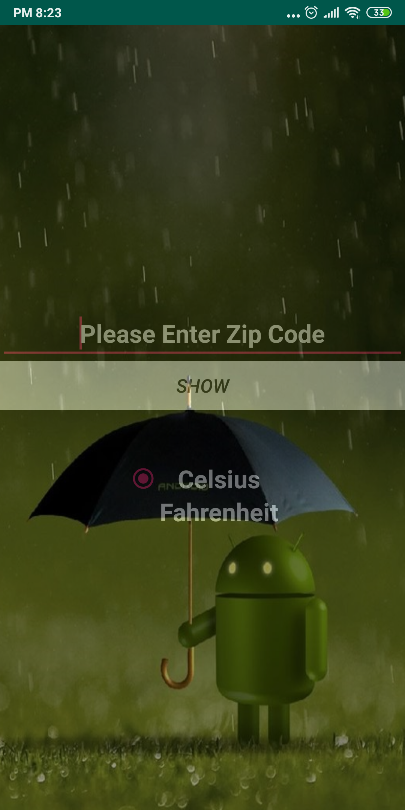
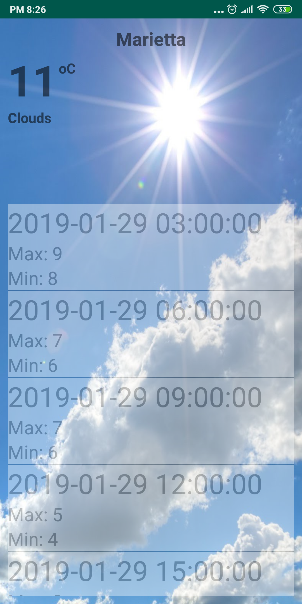

# Weekend3HomeAssignment
Weekend 3 assignment an android application of weather, showing current temparature in celsius or fahrenheit in a specific zipcode location.

The main screen where user need to provide zip code and select unit type. By default, celsius is selected.

Showing current temparature in Fahrenheit, location and forecast.

Showing current temparature in Celsius, location and forecast.

